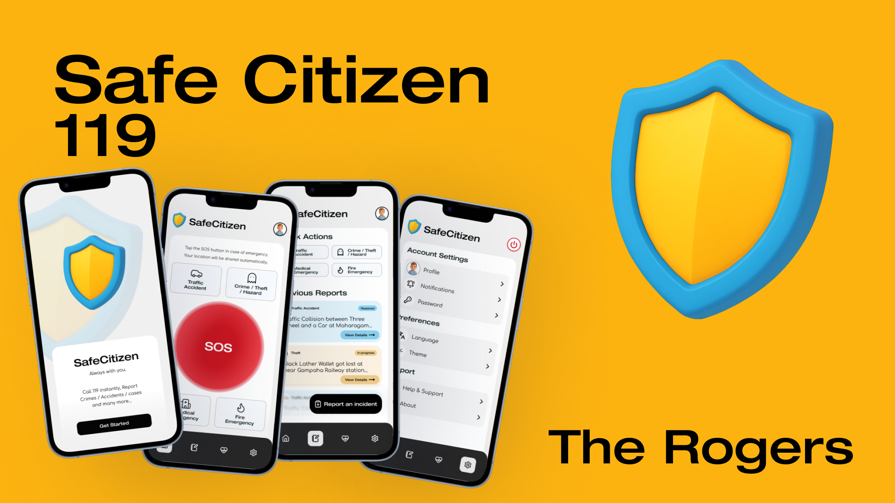

# SafeCitizen 119

SafeCitizen 119 is a mobile-first emergency response and dispatch system designed to make public safety faster, smarter, and more inclusive for all Sri Lankans. Built for the RootCode Tech-Triathlon 2025 Designathon, our solution empowers citizens to report emergencies digitally, enables headquarters to coordinate incidents in real-time, and equips police teams with instant updates and navigation.

This is a Microservices-based application, as a monorepo structure.